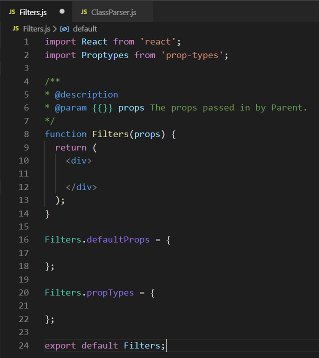

# js-snippet README

# Features

Create classes using Oloo pattern and React Classes. These classes will integrate with our other tools. 

### Other Extensions:
- JS Syntax Highlight Extension.

### Modules
- @learngamedevelopment/oloo

# Snippets

## Functional Components

## Oloo (Object Linked To Other Objects)

## Release Notes

# 1.1.0 - 1.1.1

- Introduced Oloo to some of the snippets. Breaking change for people without the module @learngamedevelopment/oloo
- Added React Function Component.

## 1.0.6 - 1.1.0

- Fixed up Error snippet.
- Changed Object.assign({} , Class) to Object.create(Class)
- Improved Enum and Error Class.

## 1.0.4 - 1.0.5

- Create Error Class.
- Update to match the JS Syntax Highlight Extension.

## 1.0.3 

- Added React Class,
- Added Next Class

### 1.0.0

- Added Create Class, Create Class with Export and Create Enum.