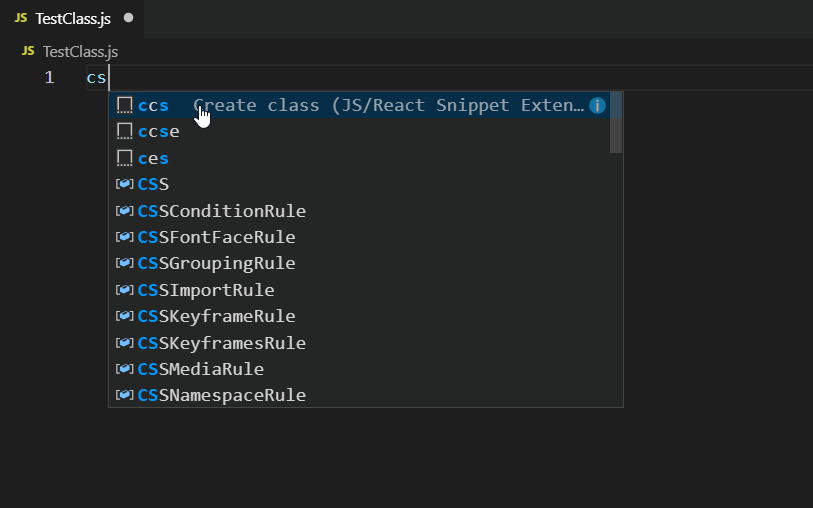

# js-snippet README

# Features

Create classes the way we like to make them. These classes will integrate with our other tools.

### Other Extensions:
- JS Syntax Highlight Extension.

### Snippets

## Release Notes

## 1.0.4 - 1.0.5

- Create Error Class.
- Update to match the JS Syntax Highlight Extension.

## 1.0.3 

- Added React Class,
- Added Next Class

### 1.0.0

- Added Create Class, Create Class with Export and Create Enum.